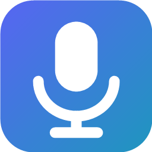

# Voice Changer Pro

Real-time voice changer for Windows 10/11. It captures any microphone, transforms the voice with a
professional DSP chain (pitch, formant, breath, rasp, tremor, EQ, dynamics and effects) and routes the
result into a **virtual audio cable** so that *every* application – games, browsers, Discord, Zoom,
Teams, softphones, recorders – hears the changed voice as if it were a normal microphone.



## Highlights

- **System-wide**: processed audio is played into a virtual cable; the cable's microphone endpoint is
  made the Windows default microphone (all roles), so every app uses it automatically. Can be enabled or
  disabled at any time – when disabled, the raw microphone passes through so calls keep working.
- **Every microphone**: each physical microphone gets its own processing engine with its own preset.
  Apply a preset to one microphone or to all of them with a single click.
- **Hot-plug**: new microphones and headsets are detected the moment they are connected (WASAPI
  endpoint notifications) and can be activated automatically with a default preset.
- **Real-time tuning**: every slider changes the sound immediately. Turn on *Hear myself* (headphones
  recommended) or record a 5-second test clip and loop it through the chain while you tweak.
- **78 realistic built-in presets**: 20 female and 20 male voices in different flavours (soft, bright,
  husky, corporate, radio, storyteller, baritone, rocker, executive, grandfather …), 11 age presets,
  10 professional/broadcast chains, 11 accent flavours and 6 utilities. No cartoon or robot voices.
  Unlimited custom presets with JSON import/export.
- **Background audio bed**: play any audio file (MP3, WAV, M4A/AAC, WMA, FLAC, MP4 audio, AIFF …) under
  your voice on the microphone channel – music beds for podcasts and radio, ambience for story recording,
  hold music on calls. Loop on/off, play/pause, restart, volume; streamed from disk, mixed *after* the
  voice chain so presets and noise removal never alter it; heard by every app and in your monitoring.
- **Global background noise & voice removal**: an adaptive spectral noise suppressor and a voice-isolation
  expander sit *outside* the presets. Two sliders, adjustable while you talk, identical for every preset
  and every microphone, remembered until you change them.
- **Professional toolset**: input gain, rumble filter, noise gate, pitch-synchronous pitch shifter
  (TD-PSOLA, formant-preserving), STFT formant shifter with pitch-adaptive spectral-envelope estimation,
  breathiness synthesis, vocal tremor, saturation, nasality, 7-band parametric EQ, de-esser, soft-knee
  compressor, ring modulator, chorus, radio/telephone band-limiter with drive, bit-crusher, echo, Freeverb
  reverb, output gain and a brick-wall limiter. Live meters for input, output, gain reduction, gate state
  and detected pitch.
- **Production hardening**: single-instance guard, tray icon with quick toggles, start with Windows,
  atomic JSON persistence, rotating file logs, crash-safe audio callbacks, automatic recovery when a
  device disappears and comes back, clock-drift compensation between capture and playback devices.

## Requirements

| Component | Notes |
|-----------|-------|
| Windows 10 1809+ or Windows 11, x64 | WASAPI shared-mode audio |
| Virtual audio cable driver | Recommended: **VB-CABLE** (free) – <https://vb-audio.com/Cable/>. Also detected: Virtual Audio Cable, VoiceMeeter, Screaming Bee, SteelSeries Sonar, NVIDIA Broadcast. |
| .NET 8 Desktop Runtime | *Not* needed for the published build in `dist\` (self-contained). Needed only when running the Debug build from `bin\`. |

## Installation

**Installer (recommended)**: download `VoiceChangerPro-Setup-<version>.exe` from the
[Releases page](https://github.com/cyberkyd01/VoiceChangerPro/releases) and run it. No administrator
rights are needed for the app itself (it installs per user by default). The wizard offers to download
and install **VB-CABLE**, the free virtual audio cable that lets other applications hear your changed
voice; that driver step asks for administrator confirmation and may need one reboot. Everything else
(the .NET runtime, the audio engine) is bundled. Uninstall from Settings › Apps like any other program.

**Portable**: `dist\VoiceChangerPro.exe` from a `build.ps1 -Publish` build runs from any folder with
no installation; install VB-CABLE separately from <https://vb-audio.com/Cable/>.

## Quick start (end users)

1. Install VB-CABLE (the installer offers this; otherwise run its setup as administrator, then reboot once).
2. Start `Voice Changer Pro`. The status pill in the toolbar turns green: *VB-CABLE ready*.
3. Your microphones are listed on the left and are already live. Pick one, choose a preset in the middle
   (double-click or *Apply*), and fine-tune it in the *Voice editor* on the right.
4. Put on headphones and switch on *Hear myself* to monitor the result in real time, or use
   *Record 5 s* + *Loop clip* to tune hands-free.
5. Click **Set as Windows default mic** (done automatically by default). Every app now receives the
   changed voice. In apps that let you choose a microphone, pick *CABLE Output (VB-Audio Virtual Cable)*.
6. Use the **Voice effects** master switch (also in the tray menu) to turn the effect on or off at any
   moment without touching the app you are talking in.

Closing the window minimises to the tray; processing continues. Exit via the tray icon.

## Building from source

```powershell
# .NET 8 SDK required (https://dotnet.microsoft.com/download/dotnet/8.0)
.\build.ps1                # restore, build, unit tests
.\build.ps1 -Publish       # + self-contained single-file build in .\dist
.\build.ps1 -Publish -Installer   # + Windows installer in .\installer\Output (needs Inno Setup 6: winget install JRSoftware.InnoSetup)
.\build.ps1 -Integration   # + real-device tests (opens the default mic and speakers)
```

Or with the CLI directly:

```powershell
dotnet build VoiceChanger.sln
dotnet test tests\VoiceChanger.Core.Tests
dotnet run --project src\VoiceChanger.App
```

## Solution layout

```
VoiceChanger.sln
├─ src/VoiceChanger.Core          # engine, DSP, devices, presets, settings, logging (no UI dependency)
│  ├─ Audio/Devices               # WASAPI enumeration + hot-plug, IPolicyConfig default device, cable detection
│  ├─ Audio/Engine                # VoiceEngine (per mic), OutputSink (render + drift control), EngineManager
│  ├─ Dsp                         # Biquad, FFT, PitchShifter, FormantShifter, Dynamics, Effects, VoicePipeline
│  ├─ Presets                     # VoiceProfile (parameter model), VoicePreset, BuiltInPresets (78), PresetStore
│  └─ Settings / Logging
├─ src/VoiceChanger.App           # WPF (Fluent/Mica UI), MVVM, tray, dialogs
└─ tests/VoiceChanger.Core.Tests  # DSP correctness, preset library, persistence, device integration
```

### Signal chain

```
mic → [global: noise suppression → voice isolation] → input gain → high-pass → noise gate
    → pitch shift (TD-PSOLA) → formant shift + breath (STFT) → tremor → rasp → nasality → EQ
    → de-esser → compressor → robot → chorus → radio → crush → echo → reverb → output gain
    → limiter → virtual cable (+ headphone monitor)
```

**Pitch** uses time-domain pitch-synchronous overlap-add (TD-PSOLA): a pitch tracker (zero-padded FFT
autocorrelation with window-bias correction, sub-harmonic guard and median smoothing) runs every 5 ms,
pitch marks are snapped to glottal pulses, and two-period Hann grains are re-spaced at the target period.
Grains are never resampled, so the vocal-tract resonances (formants) stay exactly where they were: the
voice keeps its natural character and only the fundamental moves. Unvoiced consonants pass unchanged.
**Formant** (vocal-tract size) is then an independent, absolute control: the STFT stage estimates the
spectral envelope per frame (iterative true-envelope cepstrum, lifter length following the detected
pitch period), whitens the harmonics, warps the envelope along frequency and re-applies it.

**Background noise & voice removal** is global (outside presets, identical for every preset and every
microphone, persisted in settings). *Noise removal* is an adaptive STFT Wiener suppressor: the noise
spectrum is tracked continuously with minimum statistics (no learning step), the a-priori SNR uses the
decision-directed estimator, and the slider sets the residual floor (−4 dB … −30 dB) and aggressiveness.
*Voice isolation* is a downward expander that pushes sounds quieter than the close-talking voice
(other people, TV, room chatter) down by up to 40 dB. Both react instantly to the sliders.

### Latency

DSP latency is about 80 ms at 48 kHz (noise stage 11 ms + PSOLA 48 ms + formant STFT 21 ms). With the
default 20 ms buffers the end-to-end latency shown in the status bar is roughly 150 ms; select 10 ms
buffers in *Settings* on a fast machine for around 110 ms. Monitoring through headphones is recommended
because hearing your own delayed voice through speakers is distracting and can feed back into the mic.

## Data locations

| Item | Path |
|------|------|
| Settings (per-mic configs, favourites, window state) | `%AppData%\VoiceChangerPro\settings.json` |
| Custom presets (one JSON per preset) | `%AppData%\VoiceChangerPro\presets\` |
| Logs (14-day rotation) | `%LocalAppData%\VoiceChangerPro\logs\` |

## Troubleshooting: "my microphone is silent"

If the *IN* meter never moves and the status bar shows **Mic silent — how to fix**, another voice
changer is intercepting the microphone at the driver level. The app scans for these on start-up and
names them in the log and in the *how to fix* dialog. Known offenders:

| Product | Component | Effect |
|---------|-----------|--------|
| NCH Voxal Voice Changer | `voxaldriver` registered as an *UpperFilters* entry on the Windows audio (MEDIA) device class | Every microphone on the PC passes through Voxal; when Voxal is not running the stream is silent in **all** apps, even Windows Settings |
| MorphVOX Pro | `ScreamBAudioSvc` kernel driver | Virtual "Screaming Bee Audio" device; can hold the microphone |
| AV Voice Changer Diamond | `vcs`, `VCSVADHWSer` drivers | Virtual audio device that hooks capture |

Fix: uninstall the other product (Settings › Apps › Installed apps), restart Windows, then press
*Refresh* in Voice Changer Pro. Only one product can own the microphone path. If uninstalling is not an
option, an administrator can remove the filter name from
`HKLM\SYSTEM\CurrentControlSet\Control\Class\{4d36e96c-e325-11ce-bfc1-08002be10318}\UpperFilters`
(keep `ksthunk`) and reboot.

If no interfering driver is reported, check Settings › Privacy & security › Microphone (both
*Microphone access* and *Let desktop apps access your microphone* must be on), the headset's mute
switch, and the input level under Settings › System › Sound › Input.

## Notes and limitations

- **Accent presets are tonal flavours only.** Digital signal processing cannot change pronunciation;
  those presets colour resonance and EQ and say so in their description. True accent conversion needs
  an AI voice-conversion model, which is out of scope for a real-time DSP pipeline.
- **Celebrity-inspired presets** evoke a style (deep narrator, gravel vigilante, smooth late-night
  host …). They do not clone any real person's voice.
- The virtual cable driver is a kernel component and must be installed separately (administrator
  rights, one reboot). The app never installs drivers itself.
- Setting the default microphone uses the `IPolicyConfig` COM interface, the same mechanism as popular
  audio-switching utilities; it is undocumented but has been stable since Windows 7.
- Exclusive-mode / ASIO capture is not used; shared-mode WASAPI keeps the microphone available to the
  operating system and other tools.

## License

Copyright © 2026. All rights reserved unless a license file states otherwise.
NAudio (MIT), WPF-UI (MIT) and CommunityToolkit.Mvvm (MIT) are used under their respective licenses.
